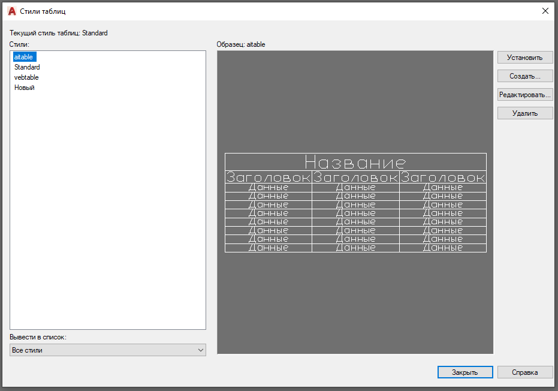

# Техническое задание — Модуль uzcui_tablestylemanager

## Версия: 1.0

---

## 1. Цель

Создать модуль `uzcui_tablestylemanager` — диалоговое окно управления табличными стилями DXF, аналогичное окну «Стили таблиц» в AutoCAD. Окно должно формироваться программными методами (без использования визуального дизайнера форм, без `.lfm`-файла). Визуальный предпросмотр стиля — заглушка (статическое изображение).

---

## 2. Эталон

Окно строится по образцу диалога AutoCAD «Стили таблиц»:



### Элементы эталонного окна:

| # | Элемент | Описание |
|---|---------|----------|
| 1 | Заголовок окна | «Стили таблиц» |
| 2 | Метка текущего стиля | «Текущий стиль таблицы: Standard» |
| 3 | Метка «Стили:» | Над списком стилей |
| 4 | Список стилей | Список имён табличных стилей (ListBox) |
| 5 | Метка «Образец:» | «Образец: <имя выбранного стиля>» |
| 6 | Область предпросмотра | Картинка-заглушка стиля таблицы |
| 7 | Кнопка «Установить» | Делает выбранный стиль текущим |
| 8 | Кнопка «Создать...» | Создаёт новый стиль таблицы |
| 9 | Кнопка «Редактировать...» | Открывает редактор стиля (заглушка) |
| 10 | Кнопка «Удалить» | Удаляет выбранный стиль |
| 11 | Метка «Вывести в список:» | Над комбобоксом фильтра |
| 12 | Комбобокс фильтра | «Все стили» / «Используемые стили» |
| 13 | Кнопка «Закрыть» | Закрывает окно |
| 14 | Кнопка «Справка» | Заглушка (неактивна на данном этапе) |

---

## 3. Архитектура

### 3.1. Размещение файлов

| Файл | Каталог | Назначение |
|------|---------|------------|
| `uzcui_tablestylemanager.pas` | `cad_source/zcad/gui/` | Модуль формы диалога |
| `uzccommand_tablestylemanager.pas` | `cad_source/zcad/commands/` | Команда вызова диалога |

### 3.2. Связь с существующими модулями

```
uzccommand_tablestylemanager.pas
  └── uzcui_tablestylemanager.pas        (форма диалога)
        ├── uzestylestablesdxf.pas        (структуры DXF-стилей таблиц)
        ├── uzedrawingsimple.pas          (доступ к DXFTableStyleTable)
        ├── uzcdrawings.pas               (drawings.GetCurrentDWG)
        ├── uzcinterface.pas              (zcUI.DOShowModal)
        ├── uzclog.pas                    (логирование)
        └── LCL (Forms, Controls, StdCtrls, ExtCtrls, Buttons, Graphics)
```

### 3.3. Используемые структуры данных

Модуль работает с DXF-стилями таблиц из `uzestylestablesdxf.pas`:

```pascal
TGDBDXFTableStyle = object(GDBNamedObject)
  CellFormats: GDBDXFCellFormatArray;       // 0=title, 1=header, 2=data
  Flags70, Flags71: Integer;
  HorzCellMargin, VertCellMargin: Double;
  TitleSuppressed, ColumnHeadingSuppressed: Boolean;
  CellTextStyleName: array[0..2] of string;
  XDictHandle: string;
end;
```

Доступ к таблице стилей:

```pascal
drawings.GetCurrentDWG^.DXFTableStyleTable
```

---

## 4. Описание формы

### 4.1. Общие параметры окна

| Параметр | Значение |
|----------|----------|
| Класс | `TTableStyleManagerForm = class(TForm)` |
| Заголовок | `'Стили таблиц'` |
| Размер | 700 × 500 пикселей (начальный) |
| Позиция | По центру экрана (`poScreenCenter`) |
| Модальность | Модальное окно |
| Создание | Программное (без `.lfm`) |

### 4.2. Компоновка (Layout)

Окно разделено на три горизонтальные зоны:

```
┌──────────────────────────────────────────────────────────────────┐
│ Метка: «Текущий стиль таблицы: <имя>»                          │
├──────────────┬───────────────────────────┬───────────────────────┤
│              │                           │ [Установить]          │
│ Метка:       │ Метка:                    │ [Создать...]          │
│ «Стили:»     │ «Образец: <имя>»          │ [Редактировать...]    │
│              │                           │ [Удалить]             │
│ ┌──────────┐ │ ┌───────────────────────┐ │                       │
│ │ ListBox  │ │ │                       │ │                       │
│ │          │ │ │  Картинка-заглушка    │ │                       │
│ │          │ │ │  предпросмотра        │ │                       │
│ │          │ │ │                       │ │                       │
│ └──────────┘ │ └───────────────────────┘ │                       │
│              │                           │                       │
│ «Вывести     │                           │                       │
│  в список:»  │                           │                       │
│ [ComboBox ▼] │                           │                       │
├──────────────┴───────────────────────────┴───────────────────────┤
│                                          [Закрыть]  [Справка]   │
└──────────────────────────────────────────────────────────────────┘
```

### 4.3. Описание панелей

| Панель | Тип | Align | Содержимое |
|--------|-----|-------|------------|
| `PanelTop` | `TPanel` | `alTop` | Метка текущего стиля |
| `PanelBottom` | `TPanel` | `alBottom` | Кнопки «Закрыть» и «Справка» |
| `PanelRight` | `TPanel` | `alRight` | Кнопки действий (Установить, Создать, Редактировать, Удалить) |
| `PanelLeft` | `TPanel` | `alLeft` | Список стилей + фильтр |
| `PanelCenter` | `TPanel` | `alClient` | Метка «Образец:» + область предпросмотра |

### 4.4. Описание элементов управления

#### 4.4.1. Метка текущего стиля (`LabelCurrentStyle`)

- **Тип:** `TLabel`
- **Родитель:** `PanelTop`
- **Текст:** `'Текущий стиль таблицы: '` + имя текущего стиля
- **Обновление:** При нажатии кнопки «Установить»

#### 4.4.2. Список стилей (`ListBoxStyles`)

- **Тип:** `TListBox`
- **Родитель:** `PanelLeft`
- **Align:** `alClient` (внутри `PanelLeft`)
- **Поведение:** При выборе элемента обновляется метка «Образец:» с именем выбранного стиля
- **Заполнение:** Из `DXFTableStyleTable` текущего чертежа

#### 4.4.3. Комбобокс фильтра (`ComboBoxFilter`)

- **Тип:** `TComboBox`
- **Родитель:** `PanelLeft` (внизу, под `ListBoxStyles`)
- **Стиль:** `csDropDownList` (только выбор из списка)
- **Элементы:**
  - `'Все стили'` (по умолчанию)
  - `'Используемые стили'`
- **Поведение:** При изменении — обновить список стилей. На данном этапе фильтр «Используемые стили» показывает все стили (заглушка).

#### 4.4.4. Метка «Образец:» (`LabelPreview`)

- **Тип:** `TLabel`
- **Родитель:** `PanelCenter`
- **Текст:** `'Образец: '` + имя выбранного стиля

#### 4.4.5. Область предпросмотра (`ImagePreview`)

- **Тип:** `TImage`
- **Родитель:** `PanelCenter`
- **Содержимое:** Статическая картинка-заглушка (серый прямоугольник с надписью «Предпросмотр недоступен»)
- **Реализация:** Рисование заглушки программно через `Canvas` компонента `TImage` (или `TPaintBox`)
- **Примечание:** Реальный рендеринг таблицы — не реализуется на данном этапе

#### 4.4.6. Кнопки действий

| Кнопка | Имя | Текст | Действие |
|--------|-----|-------|----------|
| Установить | `ButtonSetCurrent` | `'Установить'` | Устанавливает выбранный стиль как текущий |
| Создать... | `ButtonCreate` | `'Создать...'` | Создаёт новый стиль с именем по умолчанию |
| Редактировать... | `ButtonEdit` | `'Редактировать...'` | Заглушка — показывает `ShowMessage('Редактирование стиля пока не реализовано')` |
| Удалить | `ButtonDelete` | `'Удалить'` | Удаляет выбранный стиль (с подтверждением) |

#### 4.4.7. Кнопки нижней панели

| Кнопка | Имя | Текст | Действие |
|--------|-----|-------|----------|
| Закрыть | `ButtonClose` | `'Закрыть'` | Закрывает диалог (`ModalResult := mrClose`) |
| Справка | `ButtonHelp` | `'Справка'` | Заглушка (`Enabled := False`) |

---

## 5. Логика работы

### 5.1. Инициализация формы

1. Создать все элементы управления программно (в конструкторе или `FormCreate`)
2. Установить размеры и расположение панелей
3. Заполнить список стилей из `drawings.GetCurrentDWG^.DXFTableStyleTable`
4. Выбрать первый элемент в списке
5. Обновить метку текущего стиля
6. Нарисовать заглушку предпросмотра
7. Записать в лог: `'uzcui_tablestylemanager: форма инициализирована, стилей: %d'`

### 5.2. Заполнение списка стилей (`RefreshStyleList`)

```
Процедура RefreshStyleList:
  1. Очистить ListBoxStyles.Items
  2. Получить указатель: pdwg := drawings.GetCurrentDWG
  3. Итерировать по pdwg^.DXFTableStyleTable:
     - Для каждого стиля добавить имя в ListBoxStyles.Items
     - Сохранить указатель на стиль через ListBoxStyles.Items.Objects[]
  4. Если список не пуст — выбрать первый элемент
  5. Обновить метку «Образец:»
  6. Записать в лог количество загруженных стилей
```

### 5.3. Выбор стиля в списке (`ListBoxStylesClick`)

```
Процедура ListBoxStylesClick:
  1. Если ничего не выбрано — выход
  2. Обновить текст LabelPreview: 'Образец: ' + имя выбранного стиля
  3. Обновить состояние кнопок (Удалить и Установить доступны
     только если есть выбранный стиль)
```

### 5.4. Кнопка «Установить» (`ButtonSetCurrentClick`)

```
Процедура ButtonSetCurrentClick:
  1. Если ничего не выбрано — выход
  2. Запомнить имя выбранного стиля как текущий
  3. Обновить текст LabelCurrentStyle
  4. Записать в лог: 'uzcui_tablestylemanager: текущий стиль изменён на "%s"'
```

**Примечание:** Понятие «текущий стиль таблицы» на данном этапе — только визуальное отображение в диалоге. Механизм хранения текущего стиля таблицы в чертеже (аналог DIMSTYLE) — предмет отдельной задачи.

### 5.5. Кнопка «Создать...» (`ButtonCreateClick`)

```
Процедура ButtonCreateClick:
  1. Сформировать уникальное имя: 'Стиль1', 'Стиль2', ...
     (проверять наличие в таблице, увеличивать номер)
  2. Вызвать DXFTableStyleTable.AddStyle(NewName)
  3. Заполнить стиль значениями по умолчанию:
     - Три формата ячеек (title, header, data)
     - TextHeight: 2.5 для всех
     - Alignment: 0 (TopLeft)
     - TextColor: 0
     - BackgroundColor: 7
     - BackgroundColorEnabled: False
     - CellTextStyleName: 'Standard' для всех
     - HorzCellMargin: 0.06
     - VertCellMargin: 0.06
  4. Обновить список стилей (RefreshStyleList)
  5. Выбрать новый стиль в списке
  6. Записать в лог: 'uzcui_tablestylemanager: создан стиль "%s"'
```

### 5.6. Кнопка «Удалить» (`ButtonDeleteClick`)

```
Процедура ButtonDeleteClick:
  1. Если ничего не выбрано — выход
  2. Если стиль является текущим — показать предупреждение
     'Нельзя удалить текущий стиль таблицы', выход
  3. Запросить подтверждение: MessageDlg(
     'Удалить стиль "' + StyleName + '"?', mtConfirmation, ...)
  4. Если подтверждено:
     a. Удалить стиль из DXFTableStyleTable
     b. Обновить список стилей (RefreshStyleList)
     c. Записать в лог: 'uzcui_tablestylemanager: удалён стиль "%s"'
```

### 5.7. Кнопка «Редактировать...» (`ButtonEditClick`)

```
Процедура ButtonEditClick:
  1. Показать сообщение: 'Редактирование стиля пока не реализовано'
  2. Записать в лог: 'uzcui_tablestylemanager: редактирование - заглушка'
```

### 5.8. Рисование заглушки предпросмотра (`DrawPreviewStub`)

```
Процедура DrawPreviewStub:
  1. Заполнить Canvas серым фоном (clSilver)
  2. Нарисовать рамку (clGray)
  3. Вывести текст по центру: 'Предпросмотр недоступен'
  4. Шрифт: чёрный, размер 10
```

---

## 6. Команда вызова диалога

### 6.1. Файл `uzccommand_tablestylemanager.pas`

По образцу `uzccommand_textstyles.pas`:

```pascal
function TableStyleManager_cmd(
  const Context: TZCADCommandContext;
  operands: TCommandOperands): TCommandResult;
begin
  TableStyleManagerForm := TTableStyleManagerForm.Create(nil);
  SetHeightControl(TableStyleManagerForm,
    sysvar.INTF.INTF_DefaultControlHeight^);
  zcUI.DOShowModal(TableStyleManagerForm);
  FreeAndNil(TableStyleManagerForm);
  Result := cmd_ok;
end;

initialization
  CreateZCADCommand(@TableStyleManager_cmd,
    'TableStyleManager', CADWG, 0);
```

### 6.2. Имя команды

- **Внутреннее имя:** `TableStyleManager`
- **Флаги:** `CADWG` (требуется открытый чертёж)

---

## 7. Логирование

Все записи в лог — через `uzclog.pas`, только уровень `LM_Info`.

| Событие | Формат сообщения |
|---------|-----------------|
| Инициализация формы | `'uzcui_tablestylemanager: форма инициализирована, стилей: %d'` |
| Обновление списка | `'uzcui_tablestylemanager: список обновлён, стилей: %d'` |
| Установка текущего | `'uzcui_tablestylemanager: текущий стиль: "%s"'` |
| Создание стиля | `'uzcui_tablestylemanager: создан стиль "%s"'` |
| Удаление стиля | `'uzcui_tablestylemanager: удалён стиль "%s"'` |
| Редактирование (заглушка) | `'uzcui_tablestylemanager: редактирование — заглушка'` |

---

## 8. Ограничения и заглушки

На данном этапе **не реализуются**:

| Функция | Статус | Причина |
|---------|--------|---------|
| Реальный предпросмотр стиля | Заглушка (картинка) | Требуется рендеринг таблицы |
| Редактирование свойств стиля | Заглушка (сообщение) | Отдельная задача — форма редактора |
| Фильтр «Используемые стили» | Заглушка (все стили) | Нужен анализ использования стилей в чертеже |
| Кнопка «Справка» | Неактивна | Справочная система не реализована |
| Хранение текущего стиля в чертеже | Не реализовано | Требуется расширение модели данных |
| Поддержка Undo/Redo | Не реализовано | Будет добавлена при реализации редактора |

---

## 9. Зависимости

### 9.1. Используемые модули

| Модуль | Назначение |
|--------|------------|
| `uzestylestablesdxf` | Структуры данных DXF-стилей таблиц |
| `uzcdrawings` | Доступ к текущему чертежу (`drawings.GetCurrentDWG`) |
| `uzedrawingsimple` | Тип `PTSimpleDrawing` |
| `uzcinterface` | `zcUI.DOShowModal`, `SetHeightControl` |
| `uzcsysvars` | `sysvar.INTF.INTF_DefaultControlHeight` |
| `uzclog` | Логирование (`programlog`, `LM_Info`) |
| `uzccommandsabstract` | `TZCADCommandContext`, `TCommandOperands` |
| `uzccommandsimpl` | `CreateZCADCommand`, `CADWG` |
| `Forms, Controls, StdCtrls, ExtCtrls, Buttons, Graphics, Dialogs` | LCL-компоненты |

### 9.2. Компиляция

Модули должны быть добавлены в соответствующие `.lpi` / `.lpr` файлы проекта или включены через `uses` в существующих регистрационных модулях.

---

## 10. Требования к коду

В соответствии с CLAUDE.md:

1. **Комментарии** — на русском языке, поясняют смысл, а не очевидные детали
2. **Функции** — не более 30 строк, одно действие на функцию
3. **Модуль** — не более 300–500 строк
4. **Вложенность** — не более 3 уровней, использовать ранние выходы (`Exit`)
5. **Имена** — осмысленные, без сокращений и аббревиатур
6. **Отступы** — 2 пробела, строки не длиннее 100 символов
7. **Заголовок файла** — стандартный блок ZCAD + `@author`
8. **Магические числа** — запрещены, все значения через именованные константы
9. **Логирование** — через `uzclog`, только `LM_Info`

---

## 11. Критерии приёмки

1. Диалог открывается командой `TableStyleManager`
2. Список стилей заполняется из `DXFTableStyleTable` текущего чертежа
3. Выбор стиля в списке обновляет метку «Образец:»
4. Кнопка «Создать...» добавляет новый стиль со значениями по умолчанию
5. Кнопка «Удалить» удаляет выбранный стиль (с подтверждением)
6. Кнопка «Установить» обновляет метку текущего стиля
7. Кнопка «Редактировать...» показывает сообщение-заглушку
8. Область предпросмотра отображает картинку-заглушку
9. Все действия пользователя записываются в лог
10. Код соответствует стандарту оформления из CLAUDE.md
11. Модуль компилируется без ошибок и предупреждений
